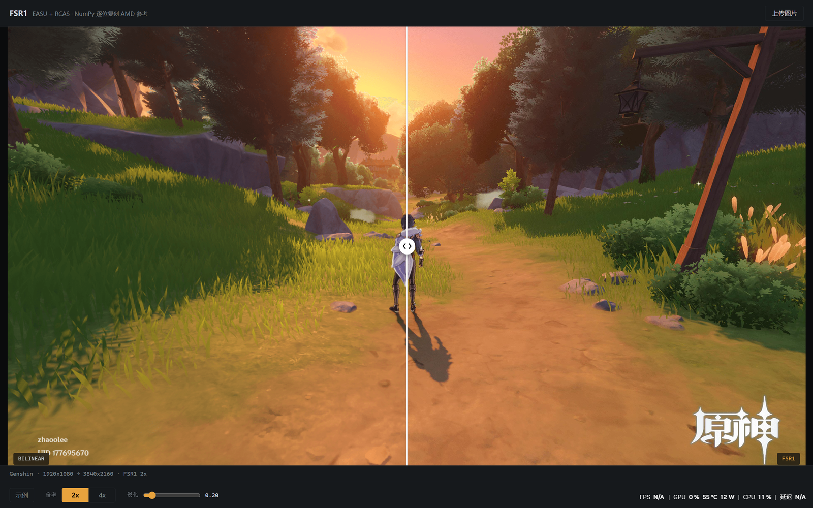

# fsr1-python

AMD FidelityFX Super Resolution 1.0（FSR1）的 NumPy 移植，逐位对应 AMD 官方参考实现。
用于学习算法本身：算法、常量、系数全部取自 `ffx_fsr1.h` / `ffx_a.h`（MIT），参考实现在
`https://github.com/GPUOpen-Effects/FidelityFX-FSR`，代码中所有不直观处均带 `# ref:` 标注。

## 算法概要

FSR 1.0 为两次纯空间滤波，以固定顺序：

    低清 RGB --EASU--> 高清 RGB --RCAS--> 输出

- **EASU**（上采样）：12 个抽头（tap）。先在输出点处估出梯度方向和边缘强度，再按方向
  旋转抽头、按强度拉伸，加权求和。边缘处权重集中，放大后边缘不糊。
- **RCAS**（锐化）：仅使用中心像素及上下左右 4 个邻像素。按中心与邻像素的距离导出负权重
  lobe，以 lobe 将邻像素叠加到中心，再限幅抑制过冲。不改变图像尺寸。

两级滤波均不引用历史帧，不需要运动矢量，亦无额外缓冲——这是 FSR1 与 FSR2/3 的
本质区别（后者为时序算法，依赖运动矢量与历史帧）。

仅实现 FP32 标量路径（`FsrEasuF` / `FsrRcasF`）。参考中的 FP16 打包路径与双 tile
路径服务于 GPU 吞吐，与算法无关；AMD 默认 FP16、FP32 为回退，本实现即对应回退路径。

## 使用

```bash
uv run python fsr1.py INPUT.png -o OUTPUT.png --scale 2.0 --sharpness 0.25
uv run python fsr1.py --selftest
```

| 参数          | 说明                                                                                                                   |
| ------------- | ---------------------------------------------------------------------------------------------------------------------- |
| `--scale`     | 每维倍率，无需为整数，默认 2.0                                                                                         |
| `--sharpness` | RCAS 锐化量，单位为档（stops）：每整档锐化量减半，0.0 最锐，约 2.0 以上无可辨差异。AMD 文档推荐 0.2，示例代码默认 0.25 |

Python 库接口：`upscale(img, scale, sharpness=None)`，输入输出均为 float32 RGB，
取值 [0,1]；`sharpness=None` 表示仅执行 EASU。

## Web 演示

全屏滑块对比页：左半为原图（浏览器双线性放大到输出尺寸），右半为 FSR1 结果，
拖动分隔线逐像素对比。内置 `sample/` 示例库（Genshin Impact、Tomb Raider 两套
1080p 原图 + 2K/4K 预跑结果），倍率 2x/4x 即时切换；上传自己的图片后替换为
API 实时计算（输入最大边 512px）。滚轮可放大细节，缩放后拖拽平移。



```bash
uv run python serve.py        # 本地：http://127.0.0.1:8000
```

部署到 Vercel（本目录即项目根，`api/upscale.py` 直接复用 `fsr1.py`）：

```bash
npx vercel deploy            # 或将本目录关联为 Vercel 项目
```

约束：输入最大边 512px、倍率 1.25-2.0、锐化 0-2.0（服务端夹取）。NumPy 路径在
512px 时约 1.2s，函数时限 60s（Hobby 计划上限），余量充足。

## 依赖

Python >= 3.12，uv 管理。运行仅依赖 NumPy，命令行另需 Pillow。

## 自检

`--selftest` 覆盖形状、值域、有限性，以及两条必须与参考一致的行为：
纯黑/纯白常数图的 NaN 处理（`0/0` 由 NaN 容错 min/max 吸收）与孤立亮点的锐化。
